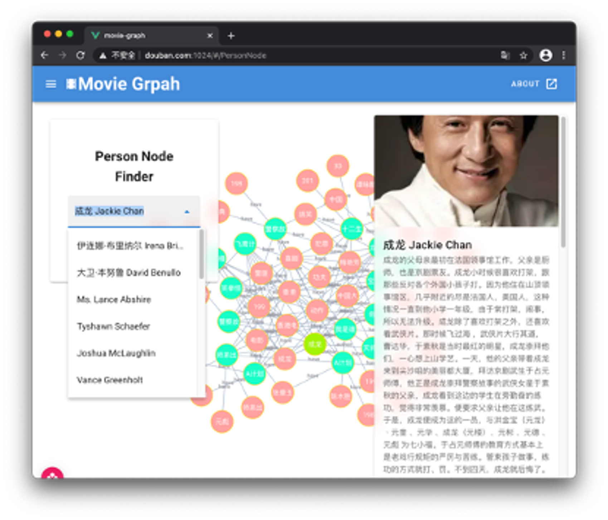
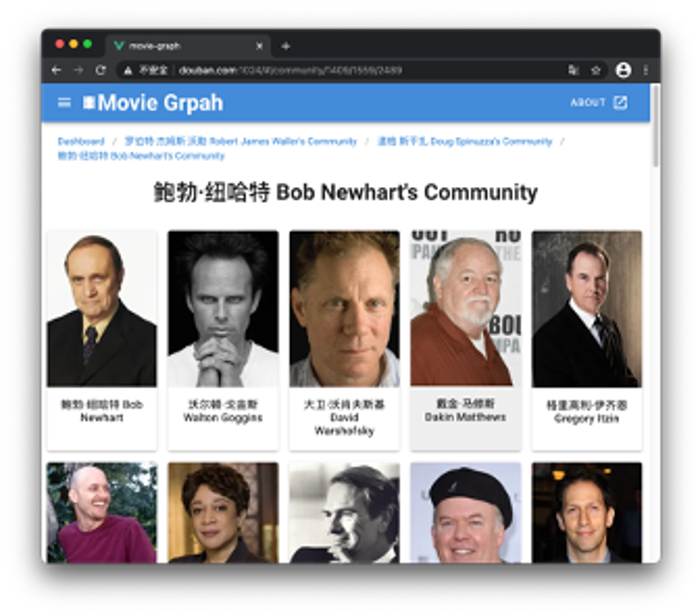

# 🎬 movie-graph

## What's This

In short, movie-graph is a project to show relationships in movie network.

This rope is the front-end of this project, and you can find the server [here](https://github.com/IchenDEV/movie-graph-backend)

In this rope we use:

- Vue
- D3
- Vuetify

## Functions

- Easily Show the relationships between a movie, another movie or person
- Show Community of person in our db
- Show relate movies of our movies

## Snapshot




## Development

### Project setup

```
yarn install
```

#### Compiles and hot-reloads for development

```
yarn serve
```

#### Compiles and minifies for production

```
yarn build

